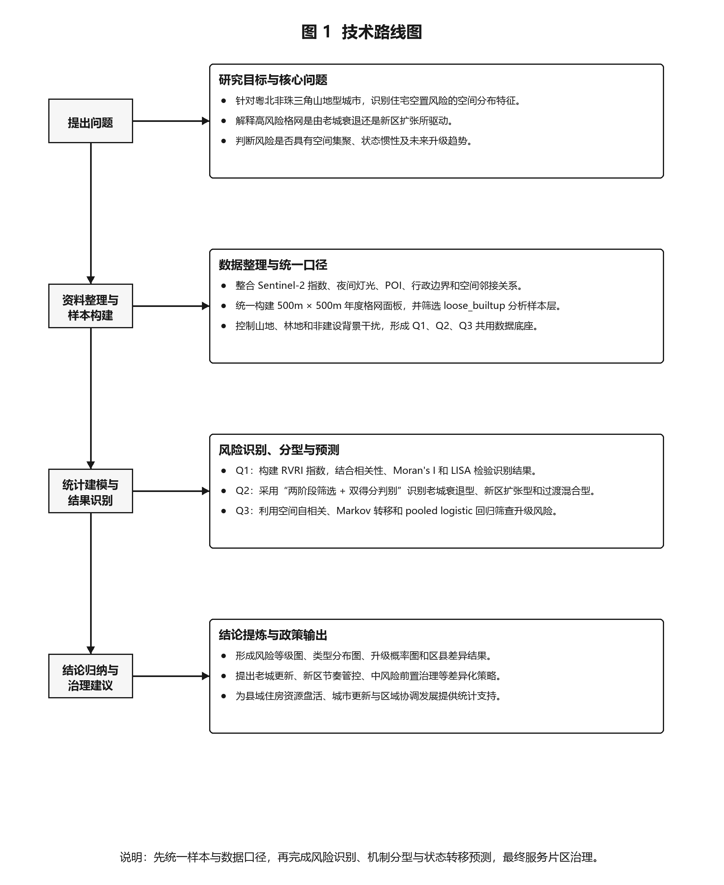

# 面向新型城镇化与区域协调发展的粤北非珠三角城市住宅空置风险识别、分型与转移预测：以韶关市为例

## 摘要

在国家推进以人为核心的新型城镇化、城市更新和广东省“百县千镇万村高质量发展工程”的背景下，非珠三角中小城市的住房存量利用效率逐渐成为县域统筹、资源配置和公共服务优化中的重要统计监测议题。针对住宅空置难以由单一指标直接观测的问题，本文以粤北门户城市韶关市为例，构建 500m × 500m 格网分析框架，融合 2019-2023 年 Sentinel-2（哨兵二号）遥感指数、夜间灯光、生活服务 POI（兴趣点）、行政区划与空间邻接关系，形成“风险识别-机制分型-转移预测”的统计建模体系。

本文首先构建住宅空置风险复合指数（Residential Vacancy Risk Index, RVRI），从建成存量压力、生态退化压力与建成-活力错配三个维度刻画疑似空置风险。主成分分析表明，第一主成分解释率为 74.00%，且 RVRI 在建成区与核心建成区中均与夜间灯光显著负相关。随后，基于 RVRI 年度面板构建“两阶段筛选、双得分判别”的类型识别框架。结果显示，在全域格网中，老城衰退型、新区扩张型和过渡混合型分别占 14.35%、13.63% 和 11.72%；在风险候选格网内部，三类机制共同揭示出韶关住宅空置风险既存在中心片区存量衰退，也存在外围组团扩张失配。空间统计结果显示，2019-2023 年 RVRI 的全局莫兰指数（Global Moran's I）均显著为正，2023 年达到 0.5840；马尔可夫（Markov）转移矩阵表明高风险状态保持概率为 0.8816，中风险向高风险升级概率为 0.2965。进一步采用合并面板逻辑回归对 2024 年非高风险格网升级概率进行排序筛查，重测结果显示模型受试者工作特征曲线下面积（ROC-AUC）为 0.7613，前 10% 高概率格网命中率为 60.29%，可为年度巡查清单和风险预警排序提供较强辅助依据。

研究表明，在缺乏逐户空置调查数据的条件下，遥感与空间统计方法能够为粤北非珠三角城市提供可复现、可解释的住宅空置风险监测方案，并为存量住房盘活、城市更新优先区识别、县域资源配置和国土空间精细化治理提供统计依据。韶关案例也可为粤东粤西粤北同类山地型、组团式中小城市建立低成本年度监测框架提供方法参考。

**关键词**：住宅空置风险；遥感统计；夜间灯光；空间自相关；马尔可夫转移；新型城镇化

## 1 问题描述与研究框架

### 1.1 研究背景

随着我国城镇化由高速增长转向高质量发展，城市治理的重点正在从外延扩张转向存量提质、功能完善和空间精细化管理。《“十四五”新型城镇化实施方案》明确提出，要推进以县城为重要载体的城镇化建设，有序推进老城区城市更新改造，并提高建设用地利用效率 [1]；《广东省新型城镇化规划（2021-2035年）》则将以人为核心的新型城镇化、城乡融合发展和粤东粤西粤北地区城镇化质量提升作为重要方向 [2]。在此背景下，部分非珠三角中小城市同时面临人口集聚能力不足、住房存量利用效率不高、新区建设与公共服务导入不同步等问题。住宅空置风险并非单纯的房地产现象，还会影响公共服务配置效率、基础设施使用强度和地方治理成本。因此，在县域统筹、城市更新和区域协调发展的政策背景下，如何以可复现、可解释的数据方法识别住宅空置风险，已成为具有现实意义的统计监测问题 [1-7,21-25]。

韶关位于广东北部，是广东省北部生态发展区的重要节点城市。《韶关市国土空间总体规划（2021-2035年）》提出构建“三屏维育、两核示范、两轴融湾、三区共生”的国土空间开发保护格局，并将韶关定位为粤北门户枢纽城市、北部生态发展区区域中心城市 [4-5]。这意味着韶关既承担生态屏障和区域协同功能，也面临中心城区、县城和外围乡镇之间的资源配置协调问题。对于这类山地型、组团式、县域差异明显的粤北城市而言，住宅空置风险往往不表现为简单的“人口少”或“建筑少”，而更多表现为建成强度、夜间活力、生态背景和区位条件之间的错配。选择韶关作为案例，并不是把粤北城市简单看作“欠发达样本”，而是因为它兼具三类在全国中小城市中较常见的结构特征：一是中心城区与外围县域之间的发展梯度明显，二是山地和生态空间对遥感识别形成较强干扰，三是城镇建设、人口活动和生活服务供给并非同步推进。这样的对象更能检验统计建模方法在复杂地形、有限公开数据和政策解释需求并存条件下的适用性。

### 1.2 文献综述

既有研究中，住宅空置识别主要沿两条路径展开。一类研究依赖调查统计、住房市场和社会经济数据，直接估计空置率或讨论其经济影响。王洁、张继良 [8] 基于重点城市面板数据分析住房空置率对房价的影响，唐如建、付光辉 [9] 则讨论了南京新建商品住宅空置的空间差异。这类研究与住房市场联系紧密，但通常受限于统计口径、更新周期和空间分辨率，难以支持年度尺度和网格尺度的精细识别。

另一类研究更多利用夜间灯光及多源空间数据识别低活力建成区或“鬼城”现象。Chen 等 [21]、Tan 等 [22] 证明了夜间灯光在城市尺度估计住房空置率方面具有可操作性；Zheng 等 [27]、Ge 等 [28] 分别从区域和全国尺度构建“鬼城指数”或“鬼城率”；Wang、Fan 和 Wang [26]、Yang 和 Pan [24] 进一步引入 OpenStreetMap 或 POI 数据，以增强对居住空间使用不足的解释；Li 和 Gong [23]、Lu 等 [29]、Jin 等 [30] 则通过多源高分辨率时空数据、昼夜遥感结合或项目级活力数据，提高了空置识别的空间精度和语义刻画能力。此外，刘沼辉等 [6]、余柏滢等 [11]、Levin 和 Zhang [25] 对夜间灯光遥感应用进行了系统总结，Zha、Gao 和 Ni [14]、Elvidge 等 [16] 也为建成强度与夜间活动刻画提供了方法基础。

总体来看，现有研究已证明多源遥感识别住房空置或城市活力差异具有可行性，但仍主要集中于超大城市、平原型城市或跨城市横截面对比，对山地型、组团式中小城市的适配性讨论不足；同时，许多研究更侧重静态识别，对连续年度风险演化、机制分型和状态转移预测关注不够。基于此，本文面向粤北非珠三角城市，尝试将住宅空置风险识别、机制分型、空间集聚和状态转移组织为一套完整的统计建模闭环，以服务年度监测和存量空间治理需求。

### 1.3 研究内容与问题设置

基于上述背景，本文围绕比赛主题“服务国家战略，创新统计赋能”，将研究对象设定为韶关市 500m 格网单元，构建面向新型城镇化与区域协调发展的住宅空置风险统计建模框架。全文回答三个递进问题：

1. 如何构建高维度住宅空置风险复合指数？
2. 如何区分老城衰退型空置与新区扩张型空置？
3. 空置风险是否具有空间自相关和状态转移规律，未来哪些区域更可能由非高风险转为高风险？

### 1.4 重要概念定义

**住宅空置风险**：本文所称住宅空置风险不是逐户实测空置率，而是基于格网尺度遥感和空间统计指标识别出的“建成强度较高但夜间活力不足、功能支撑偏弱”的疑似空置状态。

**住宅空置风险复合指数（Residential Vacancy Risk Index, RVRI）**：用于综合刻画格网内建成存量压力、生态退化压力与建成-活力错配程度。数值越高，表示该格网越可能存在建成存量与实际使用活力不匹配的问题。

**宽口径建成样本层**：第一问、第二问和第三问共同使用的统一空间分析样本。其筛选规则为年度归一化建筑指数高于 60% 分位阈值、归一化植被指数不低于 0.05，且不强制要求兴趣点或夜间灯光上下文。该样本层用于保证不同问题之间的空间口径一致。

**老城衰退型空置**：靠近本地老城核心，建成存量较大，扩张趋势不强，但活力下降或错配长期持续的空置风险。

**新区扩张型空置**：位于外围扩张带，建成强度或开发趋势上升较快，但夜间活力和功能导入滞后形成的空置风险。

**稳定对照组**：第二问中未进入空置风险候选集合的格网。该类主要用于与三类空置风险机制进行对照，不等同于逐格网层面的稳定入住住宅。

### 1.5 技术路线

本文技术路线为：

统一格网底座 -> 年度风险指数构建 -> 空置风险类型识别 -> 空间自相关与状态转移预测 -> 分区治理建议

【图 1  技术路线图】



图 1 展示本文的整体技术路线。全文先将多源遥感与空间辅助数据统一到 500m 格网，再依次完成风险指数构建、空置风险机制分型、空间自相关检验、马尔可夫状态转移和非高风险升级预测，最终形成面向年度监测和片区治理的政策建议。与单纯停留在识别层面的研究不同，本文将“风险识别 - 机制解释 - 状态转移 - 治理响应”组织为一条闭环分析链，以增强模型结果的政策可解释性 [1-5,21-25]。

### 1.6 符号体系

为避免后文模型表述过于概括，本文统一设定如下符号。设 \(i=1,\ldots,N\) 表示 500m 格网单元，\(t\in\{2019,2020,2021,2022,2023\}\) 表示年度，\(g(i)\) 表示格网所属区县，\(\mathcal{N}(i)\) 表示格网 \(i\) 的 Queen 邻接邻域。主要变量包括：

| 符号 | 统计含义 | 说明 |
|---|---|---|
| \(B_{it}\) | 归一化建筑指数（NDBI） | 建成强度和硬化地表代理变量 |
| \(V_{it}\) | 归一化植被指数（NDVI） | 生态背景和非建设背景代理变量 |
| \(L_{it}\) | 夜间灯光强度 | 居住和活动活力代理变量 |
| \(R_{it}\) | 住宅空置风险复合指数 | 综合反映建成-活力错配程度 |
| \(S_{it}\) | 风险状态 | 取 0、1、2，分别表示低、中、高风险 |
| \(W=(w_{ij})\) | 空间权重矩阵 | Queen 邻接矩阵，行标准化后用于空间滞后 |
| \(P=(p_{ab})\) | 马尔可夫转移矩阵 | 风险状态从 \(a\) 转为 \(b\) 的概率 |

### 1.7 研究创新与论文贡献

本文的创新主要体现在三个方面。第一，在研究对象上，本文没有把住宅空置风险简单处理为人口或房价问题，而是从“建成空间已经形成、夜间活动和服务支撑不足”这一可由遥感与空间数据共同刻画的角度入手，提出适用于公开数据条件下的疑似空置风险识别框架，并将研究场景拓展到粤北非珠三角山地型中小城市。第二，在模型结构上，本文把指数构建、机制分型和状态转移预测连成闭环：第一问解决“哪里风险高”，第二问解释“为什么形成不同类型风险”，第三问回答“风险是否会持续或升级”。第三，在政策表达上，本文坚持网格建模、区县解释、片区治理的尺度安排，既保留 500m 格网的统计分辨率，又避免把单个格网结果过度解释为精确行政结论。

与直接套用黑箱预测模型相比，本文更重视可解释性和可复现性。所有核心变量均能追溯到归一化建筑指数、归一化植被指数、夜间灯光、兴趣点和空间邻接关系，模型输出也分别对应指数值、类型标签、转移概率和升级概率。这样的结果既便于核查，也更容易被地方规划、住建和统计部门转化为年度监测清单。

## 2 研究方法、数据来源与预处理

### 2.1 研究方法概述

本文采用“政策问题-统计指标-空间模型-治理解释”的研究思路。首先，将住宅空置风险界定为格网尺度上“建成强度较高但夜间活力和生活服务支撑不足”的空间错配状态；其次，利用主成分分析合成住宅空置风险复合指数，并通过相关性检验和空间自相关检验验证其方向一致性；再次，在年度面板基础上构造存量压力、扩张趋势、活力错配和区位背景指标，识别老城衰退型、新区扩张型和过渡混合型三类机制；最后，通过全局莫兰指数、局部空间关联指标、马尔可夫转移矩阵和合并面板逻辑回归，刻画风险集聚、状态惯性和下一年度升级概率。

上述方法安排与本文研究问题一一对应：指数构建回答“风险在哪里”，类型识别回答“风险为何形成”，状态转移和前推预测回答“风险如何演化”。这种结构与统计建模竞赛中常见的“问题分析-模型建立-结果解释-政策建议”路径一致，也便于将模型结果转化为年度巡查和片区治理工具。

### 2.2 数据预处理流程

本文的数据预处理包括五个环节。第一，统一空间底座：以韶关市 500m 规则格网作为基本分析单元，将遥感、夜间灯光、兴趣点和行政区划数据统一映射到同一空间框架。第二，构建年度面板：对同一格网、同一年份内的多期遥感记录进行年度聚合，形成 2019-2023 年连续面板。第三，进行变量标准化：对建成强度、植被背景和夜间灯光等量纲不同的变量按年度标准化，降低不同数据源尺度差异的影响。第四，筛选建成语义样本：区分全域背景、宽口径建成样本和严格住宅候选样本，避免把山地、林地和未开发空间误判为空置风险。第五，构造模型输入：在年度面板基础上生成趋势斜率、错配持续性、邻域风险比例和行政区县变量，供类型识别和状态转移预测使用。

建议在正式排版时保留图 1 技术路线图，并在图中增加“数据预处理”模块，形成“数据采集-格网匹配-年度聚合-样本筛选-指标合成-空间建模-政策输出”的闭环流程。该流程图能够明显提升论文的工程完整性和评审可读性。

### 2.3 数据来源

本文使用的数据均在 500m 格网尺度上进行统一整理。主要数据来源见表 1。Sentinel-2（哨兵二号）多光谱数据和可见光红外成像辐射仪套件（VIIRS）夜间灯光数据分别是当前建成环境识别和人类活动强度刻画中使用较广泛的公开数据源 [6-7,10-11,16-17,25]。

**表 1  数据来源与用途**

| 数据类别 | 数据内容 | 时间范围 | 空间尺度 | 主要用途 |
|---|---|---:|---|---|
| 遥感指数 | 归一化建筑指数（NDBI）、归一化植被指数（NDVI） | 2019-2023 | 500m 格网 | 衡量建成强度、生态背景和开发状态 |
| 夜间灯光 | 年度夜间灯光强度 | 2019-2023 | 500m 格网 | 代理居住与活动活力 |
| 行政区划 | 韶关市区县边界 | 当前边界 | 区县 | 校核行政归属、绘制区县边界 |
| 兴趣点数据 | 餐饮、医院、便利店、超市、药店等生活服务点 | 本地缓存 | 点位转格网 | 辅助验证功能活跃度 |
| 空间格网 | 韶关市 500m 规则格网 | 固定底图 | 500m 格网 | 承载所有年度变量与空间邻接关系 |

### 2.4 数据质量审查

原始年度面板覆盖 2019-2023 年，每年约 7.95 万个格网。夜间灯光在山地城市中存在大量零值，该现象既反映地形和非建设用地背景，也可能导致误把未开发地识别为空置风险。因此，本文不直接在全域格网上解释住宅空置，而是通过建成区筛选、住宅候选格网筛选和宽口径建成样本层控制分析对象。

**表 2  年度原始数据质量概览**

| 年份 | 记录数 | 唯一格网数 | 正灯光比例 | 灯光缺失率 | 建成指数-灯光相关 | 植被指数-灯光相关 |
|---:|---:|---:|---:|---:|---:|---:|
| 2019 | 318132 | 79533 | 7.33% | 0.34% | 0.2470 | -0.2663 |
| 2020 | 318132 | 79533 | 8.61% | 0.34% | 0.2462 | -0.2780 |
| 2021 | 318132 | 79533 | 10.56% | 0.34% | 0.2645 | -0.3405 |
| 2022 | 318132 | 79533 | 9.92% | 0.34% | 0.2781 | -0.3631 |
| 2023 | 318132 | 79533 | 12.09% | 0.34% | 0.2628 | -0.2716 |

表 2 表明，夜间灯光缺失率较低，但零值比例较高。因此，本文将夜间灯光作为活力代理变量，而不把其作为唯一判定指标；同时结合建成强度、植被背景、兴趣点与空间邻接关系进行综合识别。这一处理也与既有研究中“夜间灯光适合作为活动强度代理，但需与其他空间语义信息联合使用”的做法一致 [6-7,10-11,21-26]。

从模型解释与应用口径看，上述处理具有必要性。韶关全域包含大量山地、林地和低强度建设空间，若将“灯光弱”直接等同于空置，易将自然背景误判为城市问题；若仅依据建成指数，则可能将新近硬化地表、道路或工业用地混入住宅语义。基于此，本文采取“先统一年度面板、再区分统计分析层与图面展示层、最后在候选格网内解释住宅空置风险”的识别策略。该策略在压缩直观样本量的同时，提高了变量语义的一致性与结果解释的稳健性。本文关于空置的表述均限定为“疑似空置风险”或“住宅空置风险代理指标”，不将模型输出等同于逐户实测空置率。

### 2.5 面板整理与数据进入模型的口径

原始数据存在同一年内季度记录重复的情况，夜间灯光在同一年各季度保持一致，因此本文先将同一格网、同一年份的观测聚合为年度面板。对任一变量 \(X\in\{B,V,L\}\)，年度聚合公式为：

\[
X_{it}=\frac{1}{n_{it}}\sum_{q=1}^{n_{it}}X_{itq},
\]

其中 \(q\) 表示同一年内的原始记录序号，\(n_{it}\) 表示格网 \(i\) 在年份 \(t\) 的有效记录数。聚合后形成 \(396302\) 条年度格网记录，覆盖 \(79353\) 个有效格网和 5 个年度。第三问进一步构造相邻年度状态对：

\[
(S_{it},S_{i,t+1}),\quad t=2019,2020,2021,2022,
\]

最终形成 \(316927\) 条相邻年度转移记录。


## 3 住宅空置风险复合指数构建

### 3.1 问题分析与指标选择

本文将住宅空置风险理解为“建成存量已经形成，但人类活动活力不足”的空间错配状态，构建三项风险同向特征。其依据在于：归一化建筑指数已被广泛用于建成区与硬化地表识别 [6,14]，夜间灯光能够较稳定表征人类活动强度和城市活力 [7,10-11,16,25]，而将建成强度、生态背景与活力错配综合起来，更接近中小城市住宅空置风险的实际语义 [8-9,21-24,26]。

由于归一化建筑指数、归一化植被指数和夜间灯光量纲不同，本文先按年度进行标准化。对任一年度 \(t\) 和变量 \(X_{it}\)，定义：

\[
Z(X_{it})=\frac{X_{it}-\bar X_t}{\sigma_{X,t}},
\]

其中 \(\bar X_t\) 和 \(\sigma_{X,t}\) 分别为年份 \(t\) 内变量 \(X\) 的均值和标准差。三项风险特征进一步定义为：

\[
stock\_pressure_{it}=Z(B_{it}),
\]

\[
eco\_deficit_{it}=-Z(V_{it}),
\]

\[
mismatch\_gap_{it}=Z(B_{it})-Z(L_{it}).
\]

上述处理保证三个特征方向一致，即数值越大表示潜在住宅空置风险越高。其中 \(stock\_pressure\) 表示建成存量压力，\(eco\_deficit\) 用于压低高植被、山地或生态背景的误判，\(mismatch\_gap\) 则直接刻画“建成强但夜间活力弱”的核心错配。

**表 3  RVRI 核心指标定义**

| 指标 | 计算口径 | 风险方向 | 解释含义 |
|---|---|---|---|
| 建成存量压力 | 标准化后的归一化建筑指数 | 越大风险越高 | 反映建成强度和潜在住宅存量 |
| 生态退化压力 | 归一化植被指数的反向标准化值 | 越大风险越高 | 排除高植被背景，刻画开发挤压状态 |
| 建成-活力错配 | 标准化建成强度减标准化夜间灯光 | 越大风险越高 | 反映“建得多但灯不亮”的错配 |

### 3.2 模型建立：指数合成方法

对每个格网 \(i\) 和年份 \(t\)，设风险特征向量为：

\[
\mathbf{x}_{i,t}=(stock\_pressure_{i,t}, eco\_deficit_{i,t}, mismatch\_gap_{i,t})^\top
\]

为避免人为赋权，本文采用主成分分析提取共同风险结构。设所有有效样本组成矩阵 \(X\in\mathbb{R}^{M\times 3}\)，其中 \(M=396302\)。先对特征矩阵做二次标准化：

\[
\tilde X_{mk}=\frac{X_{mk}-\mu_k}{s_k},\quad k=1,2,3,
\]

再计算协方差矩阵：

\[
\Sigma=\frac{1}{M-1}\tilde X^\top \tilde X.
\]

主成分载荷向量 \(\mathbf{w}\) 由最大特征值对应的特征向量给出：

\[
\Sigma \mathbf{w}=\lambda_1 \mathbf{w},\quad \lambda_1=\max(\lambda_1,\lambda_2,\lambda_3).
\]

若第一主成分载荷均值为负，则整体乘以 \(-1\)，保证三个风险特征均以正向进入指数。第一主成分解释率计算为：

\[
EVR_1=\frac{\lambda_1}{\lambda_1+\lambda_2+\lambda_3}.
\]

据此，RVRI 原始得分为：

\[
RVRI^{raw}_{i,t}=w_1 stock\_pressure_{i,t}+w_2 eco\_deficit_{i,t}+w_3 mismatch\_gap_{i,t}
\]

并按年份归一化到 \([0,1]\)，得到年度可比的风险排序指标：

\[
RVRI_{i,t}=\frac{RVRI^{raw}_{i,t}-\min_t(RVRI^{raw})}{\max_t(RVRI^{raw})-\min_t(RVRI^{raw})}
\]

在状态转移分析中，本文按年度内 RVRI 排序分位将格网划分为低、中、高三类状态：

\[
S_{it}=
\begin{cases}
0, & F_t(RVRI_{it})\leq \frac{1}{3},\\
1, & \frac{1}{3}<F_t(RVRI_{it})\leq \frac{2}{3},\\
2, & F_t(RVRI_{it})>\frac{2}{3},
\end{cases}
\]

其中 \(F_t(\cdot)\) 表示年份 \(t\) 内 RVRI 的经验分布函数。该分级不表示真实空置率等级，而表示同一年份内的相对风险状态。

**表 4  RVRI 主成分合成结果**

| 项目 | 数值 |
|---|---:|
| 建成存量压力载荷 | 0.6412 |
| 生态退化压力载荷 | 0.5885 |
| 建成-活力错配载荷 | 0.4925 |
| 第一主成分解释率 | 74.00% |
| 校准样本数 | 396302 |

表 4 显示，三项指标均正向进入第一主成分，其中建成存量压力贡献最大，生态退化压力和建成-活力错配也具有稳定贡献。这表明 RVRI 并非单一灯光指标，而是对建成空间风险结构的综合刻画。这一结果与现有关于夜间灯光和多源空间变量联合识别住宅空置的研究结论相一致 [21-24]。

PCA 在本文中并非为了追求复杂算法，而是为了减少人为赋权带来的主观性。若直接设定“建成强度、植被退化、灯光错配”三者等权，权重依据容易被视为经验判断；若使用监督模型，又缺少真实逐户空置率标签。主成分方法处在二者之间：它利用样本内部协方差结构提取共同变化方向，同时保留各指标的可解释含义。第一主成分解释率达到 74.00%，说明三个风险特征存在较强共同结构，适合作为后续分型与转移分析的统一指数。

### 3.3 指数有效性检验

本文从内部一致性、空间集聚性和外部辅助效度三个方面检验 RVRI。内部一致性结果见表 5。

内部一致性主要检验 RVRI 是否符合“建成空间内夜间活力越弱、空置风险越高”的理论方向。对任意两个变量 \(X\) 和 \(Y\)，Pearson 相关系数定义为：

\[
\rho_{XY}=\frac{\sum_{m=1}^{M}(X_m-\bar X)(Y_m-\bar Y)}
{\sqrt{\sum_{m=1}^{M}(X_m-\bar X)^2}\sqrt{\sum_{m=1}^{M}(Y_m-\bar Y)^2}}.
\]

本文分别在全样本、建成区样本和核心建成区样本中计算 \(\rho(RVRI,L)\) 与 \(\rho(RVRI,mismatch\_gap)\)。其中建成区样本和核心建成区样本定义为：

\[
\Omega_{urban}=\{(i,t)\mid B_{it}\ge q_{0.75}(B)\},
\]

\[
\Omega_{core}=\{(i,t)\mid B_{it}\ge q_{0.90}(B)\},
\]

其中 \(q_p(B)\) 表示全部年度有效样本中建成强度指标的 \(p\) 分位数。

**表 5  RVRI 内部一致性检验**

| 样本类型 | 样本量 | NDBI 阈值 | RVRI-灯光相关 | RVRI-错配相关 |
|---|---:|---:|---:|---:|
| 全样本 | 396302 | 不筛选 | 0.0711 | 0.6759 |
| 建成区样本 | 99076 | -0.1473 | -0.3514 | 0.5293 |
| 核心建成区样本 | 39631 | -0.0706 | -0.6679 | 0.7195 |

全样本中 RVRI 与灯光相关性较弱，说明山地、生态和非建设空间会干扰空置解释。进入建成区后，RVRI 与夜间灯光呈显著负相关，且核心建成区中负相关进一步增强，表明 RVRI 在住宅语义更明确的空间内具有更好的解释力。

### 3.4 年度空间聚集结果

为检验 RVRI 是否呈现空间集聚，本文在严格住宅候选格网上计算 Moran's I 和 LISA 聚类。Moran's I 与 LISA 是刻画全局集聚和局部集聚最常用的空间统计方法之一 [12-13,19]。年度结果见表 6。

严格住宅候选格网不是直接取全市格网，而是同时满足建成强度、非裸地背景和聚落上下文三类条件。对年份 \(t\)，候选集合定义为：

\[
\Omega^{strict}_t=\{i\mid B_{it}\ge q_{0.75,t}(B),\ V_{it}\ge 0.10,\ C_{it}=1\},
\]

其中 \(q_{0.75,t}(B)\) 为年份 \(t\) 的 NDBI 75% 分位数，\(C_{it}\) 为聚落上下文变量：

\[
C_{it}=I(L_{it}>0\ \vee\ \exists j\in\mathcal{N}(i),L_{jt}>0\ \vee\ POI_i>0).
\]

在候选集合内，本文以 Queen 邻接矩阵计算全局 Moran's I。设 \(z_i=R_{it}-\bar R_t\)，\(w_{ij}=1\) 表示格网 \(i\) 与 \(j\) 邻接，否则为 0，则：

\[
I_t=\frac{n_t}{S_0}\cdot
\frac{\sum_i\sum_j w_{ij}z_i z_j}
{\sum_i z_i^2},
\quad
S_0=\sum_i\sum_j w_{ij},
\]

其中 \(n_t\) 为当年候选格网数。显著性通过随机置换检验获得：

\[
p=\frac{1+\#\{|I_t^{perm}|\ge |I_t^{obs}|\}}{1+B},
\]

\(B\) 为置换次数。

局部 LISA 则用于识别 HH、LL、HL、LH 聚集类型。对格网 \(i\)，局部 Moran 统计量为：

\[
I_i=z_i\sum_j w_{ij}z_j.
\]

若 \(z_i>0\) 且空间滞后 \(\sum_jw_{ij}z_j>0\)，并通过显著性检验，则记为 HH；若二者均小于 0，记为 LL；若本地高、邻域低，记为 HL；若本地低、邻域高，记为 LH。

**表 6  严格住宅候选格网年度检验结果**

| 年份 | 候选格网数 | 正灯光候选格网数 | Moran's I | HH 数量 | POI Spearman | CCDM 均值 | RVRI-CCDM 相关 |
|---:|---:|---:|---:|---:|---:|---:|---:|
| 2019 | 5823 | 3937 | 0.5097 | 2079 | -0.2280 | 0.1289 | -0.1758 |
| 2020 | 6675 | 4639 | 0.5937 | 2670 | -0.1931 | 0.1403 | -0.2773 |
| 2021 | 7862 | 5651 | 0.5771 | 3139 | -0.2034 | 0.1595 | -0.2383 |
| 2022 | 7507 | 5279 | 0.5231 | 2792 | -0.2204 | 0.1529 | -0.1901 |
| 2023 | 8405 | 6259 | 0.6256 | 3210 | -0.2316 | 0.1711 | -0.2593 |

表 6 表明，2019-2023 年住宅候选格网的风险水平均表现出显著空间集聚。2023 年 Moran's I 达 0.6256，为严格候选格网口径下的最高值，说明最新年份高风险格网的片区化特征更明显。POI 相关系数和 CCDM 相关系数均为负，表明生活服务活跃度和建成-活力协调度较高的区域，其 RVRI 通常较低。

【图 2  2019-2023 年 RVRI 均值与 Moran's I 演化图】

【图 3  2023 年 RVRI LISA 空间聚集图】

【图 4  RVRI 与夜间灯光、POI 活跃度关系图】

如图 2 所示，2019-2023 年住宅空置风险指数的年度均值与空间集聚强度呈现同步波动，说明风险并非随机分散，而是具有较稳定的片区化特征。图 3 进一步展示了 2023 年局部空间关联格局，其中高-高集聚区表示高风险格网与周边高风险格网相邻，是后续治理中更需要优先关注的连续片区；低-低集聚区则表示相对稳定的低风险连片区域。图 4 用于说明风险指数与夜间灯光、生活服务活跃度之间的对应关系：夜间灯光和生活服务越活跃的区域，住宅空置风险通常越低，符合“建成强、活力弱”才构成疑似空置风险的基本判断。

## 4 空置风险类型识别

### 4.1 问题分析与分型思路

第二问不再重复回答“哪里风险高”，而是识别高风险背后的形成机制。对韶关这类组团化、山地化城市而言，住宅空置风险至少存在两条演化路径：一类是在传统中心附近形成较大建成存量后，扩张趋缓而活力回落，逐步演化为存量衰退型风险；另一类是在外围扩张带中，建成空间增长快于人口、服务和夜间活力导入，形成增量扩张型风险。若仅依据 2023 年单期 RVRI 高低聚类，容易把两类机制混为同一种“高风险”。这一判断也与北京、西安等城市研究中揭示出的“中心衰退”与“外围扩张”并存现象具有一致性 [23-24]。基于此，本文采用“两阶段筛选、双得分判别”的四分类框架：

1. 第一阶段筛选建成区与空置风险候选格网；
2. 第二阶段在候选格网中构造老城衰退得分和新区扩张得分；
3. 根据得分差异划分老城衰退型、新区扩张型和过渡混合型；
4. 未进入候选集的格网保留为稳定对照组，仅作为空间背景和对照口径，不作为真实稳定入住住宅进行解释。

第二问的格网级特征由 2019-2023 年年度面板压缩得到。对任一变量 \(X_{it}\)，其五年均值和线性趋势斜率定义为：

\[
\bar X_i=\frac{1}{T}\sum_{t=2019}^{2023}X_{it},
\]

\[
\hat\beta_i(X)=
\frac{\sum_t(t-\bar t)(X_{it}-\bar X_i)}
{\sum_t(t-\bar t)^2}.
\]

据此，本文分别得到建成压力、错配程度、夜间灯光和建成强度的五年变化斜率：

\[
\beta_i^{B},\quad \beta_i^{M},\quad \beta_i^{L},\quad \beta_i^{D}.
\]

高风险频率用于刻画风险是否持续出现：

\[
f_i=\frac{1}{T_i}\sum_t I(S_{it}=2).
\]

建设-活力滞后和持续错配分别定义为：

\[
G_i=\beta_i^{B}-\beta_i^{L},
\]

\[
P_i=\overline{M}_i\cdot f_i.
\]

其中 \(G_i\) 表示建设-活力滞后程度，数值越大说明建成压力上升快于夜间活力导入；\(P_i\) 表示持续错配程度，数值越大说明格网长期处于高错配、高风险状态。由此，第二问同时利用截面水平、五年变化趋势和风险持续性三类信息，而不是仅凭单一年份观测对空置类型作静态划分。

### 4.2 模型建立：类型判别指标

**表 7  空置风险类型识别指标体系**

| 变量组 | 指标含义 | 识别含义 |
|---|---|---|
| 当前风险状态 | 最近年份风险水平与风险等级 | 判断当前空置风险强度 |
| 存量压力 | 五年平均建成压力及其变化趋势 | 区分存量稳定衰退与增量扩张 |
| 活力错配 | 五年平均错配程度、错配变化趋势和灯光变化趋势 | 判断建成和活力是否长期背离 |
| 扩张滞后 | 建成压力变化快于夜间活力导入的程度 | 识别建设快于活力导入的区域 |
| 空间区位 | 距本地核心距离、核心-边缘位置和生活服务密度 | 区分传统核心、过渡区和外围扩张带 |

老城衰退型强调“近核心、存量大、错配持续、扩张不强”；新区扩张型强调“远核心、扩张快、建设快于活力导入”；过渡混合型用于承接新旧交界、机制不单一或得分接近的格网。

其中，空间区位变量并非直接援引经验划定的老城或新区边界，而是由空间上下文计算得到。具体做法是先在各区县内部选取城市化综合得分位于前 5% 的格网作为本地核心，再计算各格网到本地核心的距离，并将距离不超过 500m、500-3000m、大于 3000m 的格网分别识别为核心区、边缘区和外围区。这样，“近核心”与“外围扩张带”的判别建立在统一的相对中心性口径上，而不是依赖主观划定的规划边界。

在正式分类前，本文先筛选宽口径建成样本和空置风险候选样本。2023 年宽口径建成样本条件为：

\[
D_i=I(B_{i,2023}\ge q_{0.60,2023}(B)\ \wedge\ V_{i,2023}\ge 0.05).
\]

当前阈值为 \(q_{0.60,2023}(B)=-0.1964\)，因此 2023 年进入宽口径建成样本的格网数为 \(31637\)。在建成样本中，若满足以下任一风险条件，则进入第二问候选集合：

\[
H_i=I(S_{i,2023}\ge 1\ \vee\ R_{i,2023}\ge q_{0.65}(R_{2023})
\vee f_i\ge 0.40
\vee \overline{M}_i\ge q_{0.65}(\overline{M})).
\]

其中 \(q_{0.65}(R_{2023})=0.4293\)，\(q_{0.65}(\overline{M})=0.2999\)，高风险持续频率阈值为 0.40。由此得到空置风险候选格网 \(31498\) 个，仅有 \(139\) 个建成样本未进入候选集合。可见，第二问的核心任务并非在全域格网上做宽泛分群，而是在已建成样本内部进一步区分空置风险的形成机制。

对候选格网，本文先将各判别变量做标准化：

\[
Z_k(i)=\frac{x_{ik}-\bar x_k}{s_k}.
\]

再构造老城衰退得分：

\[
\begin{aligned}
Old_i=&Z(R_{i,2023})+Z(\overline{B}_i)+Z(\overline{M}_i)+Z(P_i)+Z(f_i)\\
&+Z(-\beta_i^{B})+Z(-\beta_i^{L})+Z(-d_i)+Z(p_i)+Z(-c_i).
\end{aligned}
\]

新区扩张得分定义为：

\[
\begin{aligned}
New_i=&Z(R_{i,2023})+Z(\beta_i^{B})+Z(\beta_i^{D})+Z(G_i)+Z(\beta_i^{M})\\
&+Z(d_i)+Z(-p_i)+Z(c_i).
\end{aligned}
\]

其中 \(\overline{B}_i\) 表示五年平均建成压力，\(\overline{M}_i\) 表示五年平均错配程度，\(d_i\) 表示到本地核心的距离，\(p_i\) 表示生活服务密度，\(c_i\) 表示核心-边缘位置编码。分类依据为得分差：

\[
\Delta_i=Old_i-New_i.
\]

阈值设为：

\[
\tau=\max(0.5,\ 0.35\cdot sd(\Delta_i)).
\]

最终分类规则为：

\[
Type_i=
\begin{cases}
0, & H_i=0,\\
1, & H_i=1,\ \Delta_i\ge \tau,\\
2, & H_i=1,\ \Delta_i\le -\tau,\\
3, & H_i=1,\ |\Delta_i|<\tau.
\end{cases}
\]

所有变量先标准化再进入得分，以消除量纲差异，使各项指标反映相对偏离程度而非绝对数值大小。在缺乏逐户空置标签的条件下，本文不采用黑箱式监督分类，而采用机制导向的同权加总规则：\(Old_i\) 强调高存量、持续错配、近核心与扩张趋缓，\(New_i\) 强调扩张加速、建设-活力滞后与远核心区位。阈值 \(\tau\) 根据样本得分离散度自适应调整，并设置 0.5 的下限，以避免得分非常接近时被强行划入某一种单一机制。该思路与既有多源数据住宅空置识别研究中强调“空间语义+活动强度+区位背景”联合判别的做法相吻合 [21-24]。

该规则的含义是：候选格网若老城衰退得分显著高于新区扩张得分，则归入老城衰退型；若新区扩张得分显著更高，则归入新区扩张型；若两种机制接近，则归入过渡混合型，避免对边界格网进行硬性二分。

**表 7-1  类型识别候选筛选关键阈值与样本量**

| 项目 | 数值 |
|---|---:|
| 输入格网数 | 79353 |
| 2023 年建成指数 60% 分位阈值 | -0.1964 |
| 植被指数下限 | 0.0500 |
| 宽口径建成样本数 | 31637 |
| RVRI 65% 分位阈值 | 0.4293 |
| mismatch_mean 65% 分位阈值 | 0.2999 |
| 高风险频率阈值 | 0.4000 |
| 空置风险候选格网数 | 31498 |
| 未进入建成样本格网数 | 47716 |

### 4.3 总体分型结果

**表 8  空置风险四类型总体结果**

| 类型 | 类型名称 | 样本数 | 占比 | 2023 年风险指数均值 | 存量压力均值 | 存量斜率均值 | 错配均值 | 灯光斜率均值 | 建成指数斜率均值 |
|---:|---|---:|---:|---:|---:|---:|---:|---:|---:|
| 0 | 稳定占用型 | 47855 | 60.31% | 0.3138 | -0.6361 | -0.0175 | -0.5035 | 0.0148 | -0.0045 |
| 1 | 老城衰退型空置 | 11384 | 14.35% | 0.5608 | 1.4741 | -0.0401 | 1.2301 | 0.1512 | -0.0007 |
| 2 | 新区扩张型空置 | 10817 | 13.63% | 0.4740 | 0.4246 | 0.1045 | 0.2607 | 0.0207 | 0.0097 |
| 3 | 过渡混合型 | 9297 | 11.72% | 0.5081 | 0.9682 | 0.0118 | 0.7650 | 0.0766 | 0.0026 |

表 8 显示，从全域统计口径看，稳定对照组占比最高；但结合表 8-1 可知，该类中 \(47716\) 个格网为未进入建成样本的背景格网，真正位于建成样本内但未进入风险候选集的格网仅有 \(139\) 个。因此，稳定对照组在机制解释上更适合作为空间背景和对照口径，不宜被直接等同于“稳定入住住宅”。若讨论空置风险的形成机制，分析主体应限定为 \(31498\) 个空置风险候选格网。

在候选样本内部，三类空置风险表现出清晰差异。老城衰退型空置的 2023 年 RVRI 均值最高，为 \(0.5608\)，其存量压力均值和错配均值分别达到 \(1.4741\) 和 \(1.2301\)，说明该类格网更典型地表现为“既有建成存量大、长期错配深”；结合类型剖面结果，其到本地核心的平均距离仅为 413m，中位数为 0m，表明该类主要分布于传统中心及其紧邻片区。新区扩张型空置的当前 RVRI 水平虽低于老城衰退型和过渡混合型，但存量斜率均值与 NDBI 斜率均值分别达到 \(0.1045\) 和 \(0.0097\)，在各类中最高，其突出特征不在于当前错配绝对值最大，而在于建成扩张快于活力导入；其到本地核心的平均距离为 4544m，中位数约为 3000m，明显位于外围扩张带。过渡混合型在 RVRI、存量压力和错配程度上均介于前两类之间，到本地核心的平均距离为 2162m，更多出现在新旧交界和功能转换尚未完成的过渡空间。

为避免类型语义混淆，本文进一步列出筛选状态与最终类型的交叉关系。

**表 8-1  筛选状态与最终类型交叉表**

| 筛选状态 | 稳定对照组 | 老城衰退型空置 | 新区扩张型空置 | 过渡混合型 |
|---|---:|---:|---:|---:|
| 未进入建成样本 | 47716 | 0 | 0 | 0 |
| 建成样本内非候选格网 | 139 | 0 | 0 | 0 |
| 空置风险候选格网 | 0 | 11384 | 10817 | 9297 |

因此，第二问机制解释的主体应放在 \(31498\) 个空置风险候选格网上；稳定对照组主要作为全样本对照和空间背景，不作为老城/新区机制比较的核心对象。

### 4.4 区县分异结果

**表 9  官方区县空置风险类型占比**

| 区县 | 样本数 | 稳定占用型 | 老城衰退型空置 | 新区扩张型空置 | 过渡混合型 |
|---|---:|---:|---:|---:|---:|
| 乐昌市 | 10310 | 48.74% | 19.98% | 14.82% | 16.46% |
| 乳源瑶族自治县 | 9695 | 57.90% | 16.16% | 14.74% | 11.20% |
| 仁化县 | 9410 | 68.89% | 9.63% | 11.35% | 10.13% |
| 南雄市 | 9794 | 45.58% | 20.95% | 18.18% | 15.28% |
| 始兴县 | 9013 | 64.44% | 14.59% | 12.64% | 8.33% |
| 新丰县 | 8311 | 82.08% | 8.53% | 4.60% | 4.79% |
| 曲江区 | 6862 | 60.07% | 10.92% | 15.30% | 13.71% |
| 武江区 | 2857 | 56.67% | 5.36% | 23.45% | 14.53% |
| 浈江区 | 2425 | 44.49% | 12.70% | 24.54% | 18.27% |
| 翁源县 | 9203 | 63.15% | 15.67% | 10.11% | 11.07% |
表 9 表明，官方区县中南雄市、乐昌市的老城衰退型占比较高，说明传统中心附近的存量片区衰退和长期错配问题更突出；浈江区、武江区的新区扩张型占比较高，提示中心城区边缘及外拓片区更容易出现“建设先行、活力滞后”的风险；新丰县稳定对照组占比较高，但结合前文交叉表，这一结果更应理解为其纳入样本中进入空置风险候选集的格网较少，而不能直接解释为稳定入住水平显著更高。

【图 5  四类型空间分布图】

【图 6  各区县四类型占比堆叠图】

如图 5 所示，老城衰退型空置更多贴近本地核心和传统建成片区，新区扩张型空置则更多分布在外围扩张带和组团边缘，过渡混合型主要出现在新旧空间转换地带。图 6 进一步从区县尺度展示四类风险结构差异：南雄、乐昌等地老城衰退型占比较高，浈江、武江等中心城区的新区扩张型占比较高，说明不同区县适合采用差异化治理策略。

## 5 空间自相关、状态转移与预测模型

### 5.1 空间权重矩阵

本文以 500m 格网为节点，采用 Queen 邻接规则构建空间权重矩阵。该规则符合地理学第一定律所强调的“邻近单元之间更可能相互影响”的基本思想 [18-19]。若格网 \(i\) 与格网 \(j\) 共享边或顶点，则定义二元邻接关系：

\[
a_{ij}=
\begin{cases}
1, & j\in \mathcal{N}(i),\\
0, & j\notin \mathcal{N}(i).
\end{cases}
\]

为消除不同格网邻居数量差异，进一步做行标准化：

\[
w_{ij}=\frac{a_{ij}}{\sum_j a_{ij}}.
\]

当前空间权重文件包含 \(79533\) 个节点、\(624756\) 条有向邻接边，估计无向邻接边为 \(312378\) 条，平均度为 \(7.8553\)。该权重矩阵后续同时用于 Moran's I、LISA、空间滞后变量和邻域高风险比例计算。

### 5.2 年度空间自相关

为保证三部分研究口径一致，本文在宽口径建成样本层内计算全局莫兰指数和局部空间关联指标。结果见表 10。前者用于刻画风险的整体集聚性，后者用于识别局部热点、冷点和空间离群结构 [12-13,19]。

统一样本层定义为：

\[
\Omega^{loose}_t=\{i\mid B_{it}\ge q_{0.60,t}(B),\ V_{it}\ge 0.05\}.
\]

在 \(\Omega^{loose}_t\) 中，以行标准化权重 \(w_{ij}\) 计算空间滞后：

\[
Lag(R)_{it}=\sum_j w_{ij}R_{jt}.
\]

全局 Moran's I 的计算式为：

\[
I_t=\frac{n_t}{S_0}\frac{\sum_i\sum_j w_{ij}(R_{it}-\bar R_t)(R_{jt}-\bar R_t)}
{\sum_i(R_{it}-\bar R_t)^2}.
\]

局部 LISA 采用标准化变量 \(z_{it}=(R_{it}-\bar R_t)/s_t\)：

\[
I_{it}^{local}=z_{it}\sum_jw_{ij}z_{jt}.
\]

通过置换检验得到局部显著性 \(p_{it}\)。当 \(p_{it}\le 0.05\) 时，根据 \(z_{it}\) 与空间滞后 \(\sum_jw_{ij}z_{jt}\) 的符号划分 HH、LL、HL、LH；否则记为 NS。

**表 10  统一样本层年度莫兰指数结果**

| 年份 | Moran's I | 置换检验 p 值 | z 值 | HH 数量 | LL 数量 | 分析样本数 |
|---:|---:|---:|---:|---:|---:|---:|
| 2019 | 0.5517 | 0.005 | 147.511 | 4357 | 1916 | 31630 |
| 2020 | 0.5624 | 0.005 | 145.349 | 4689 | 2142 | 31605 |
| 2021 | 0.5916 | 0.005 | 163.938 | 4704 | 2388 | 31622 |
| 2022 | 0.5374 | 0.005 | 152.080 | 4513 | 2217 | 31598 |
| 2023 | 0.5840 | 0.005 | 160.921 | 4649 | 2100 | 31637 |

表 10 显示，2019-2023 年 RVRI 空间自相关均显著为正，表明高风险与低风险格网均存在明显空间集聚，住宅空置风险具有稳定的片区分异特征。

进一步看，空间自相关结果表明住宅空置风险并非单点现象，而更可能嵌入片区层面的交通可达性、公共服务供给、产业人口导入与开发节奏之中。因此，第三问继续引入空间马尔可夫分析和邻域高风险比例，以刻画风险状态的邻域条件依赖。

【图 7  年度莫兰指数趋势图】

【图 8  2023 年局部空间关联聚类图】

如图 7 所示，2019-2023 年全局莫兰指数均为正且通过显著性检验，说明住宅空置风险在年度尺度上持续表现为空间集聚而非随机分布。图 8 给出了 2023 年局部空间关联聚类结果，其中高-高集聚区代表高风险连续片区，低-低集聚区代表低风险稳定片区，高-低和低-高类型则提示局部空间离群，需要结合周边开发节奏和功能配套进一步解释。

### 5.3 马尔可夫状态转移

本文将年度 RVRI 按年内分位划分为低风险、中风险和高风险三类状态，并构造相邻年度状态对。总体转移矩阵见表 11。马尔可夫链方法适合用于刻画离散状态在相邻时期之间的保持、升级与回落概率 [20]。

对状态 \(a,b\in\{0,1,2\}\)，记：

\[
n_{ab}=\#\{(i,t)\mid S_{it}=a,\ S_{i,t+1}=b\}.
\]

则一阶马尔可夫转移概率为：

\[
p_{ab}=P(S_{i,t+1}=b\mid S_{it}=a)=\frac{n_{ab}}{\sum_{b=0}^{2}n_{ab}}.
\]

所有 \(p_{ab}\) 组成状态转移矩阵：

\[
P=
\begin{bmatrix}
p_{00}&p_{01}&p_{02}\\
p_{10}&p_{11}&p_{12}\\
p_{20}&p_{21}&p_{22}
\end{bmatrix}.
\]

若以 \(\boldsymbol{\pi}_t=(\pi_{0t},\pi_{1t},\pi_{2t})\) 表示某一年低、中、高风险状态占比，则 \(k\) 年后情景外推为：

\[
\boldsymbol{\pi}_{t+k}=\boldsymbol{\pi}_tP^k.
\]

**表 11  风险状态马尔可夫转移矩阵**

| 当前状态 | 下一年低风险 | 下一年中风险 | 下一年高风险 |
|---|---:|---:|---:|
| 低风险 | 0.6267 | 0.3304 | 0.0430 |
| 中风险 | 0.0211 | 0.6824 | 0.2965 |
| 高风险 | 0.0040 | 0.1144 | 0.8816 |

表 11 显示，高风险状态保持概率达到 0.8816，远高于回落至低风险的 0.0040，说明高风险格网一旦形成，短期内通常难以自行消退，具有较强路径依赖。与此同时，中风险转高风险概率为 0.2965，明显高于低风险直接转高风险的 0.0430，说明中风险格网是风险升级的主要过渡层，也是年度监测中最值得关注的缓冲带。

据此可见，治理上既要关注既有高风险片区的稳控，也要把中风险片区纳入前置干预范围。

### 5.4 空间马尔可夫对比

为判断邻域环境是否改变风险演化方向，本文进一步引入空间马尔可夫分析，比对不同邻域风险环境下的条件转移概率。这一思路与空间过程研究中强调邻域状态依赖性的观点一致 [18-20]。

空间马尔可夫分析的核心是把邻域环境纳入条件转移概率。本文先计算邻域高风险比例：

\[
H_{it}^{nbr}=\sum_jw_{ij}I(S_{jt}=2).
\]

然后按年份内分位将 \(H_{it}^{nbr}\) 划分为低邻域风险、中邻域风险和高邻域风险三类，记为 \(E_{it}\in\{low,mid,high\}\)。空间条件转移概率定义为：

\[
p_{ab}^{(e)}=P(S_{i,t+1}=b\mid S_{it}=a,\ E_{it}=e)
=\frac{n_{ab}^{(e)}}{\sum_b n_{ab}^{(e)}}.
\]

若 \(p_{12}^{(high)}>p_{12}^{(low)}\)，说明中风险格网处在高风险邻域中更容易升级为高风险；若 \(p_{22}^{(high)}>p_{22}^{(low)}\)，说明高风险状态在高风险邻域中更容易持续。

**表 12  空间马尔可夫关键转移概率**

| 邻域风险环境 | P(低 -> 高) | P(中 -> 高) | P(高 -> 高) |
|---|---:|---:|---:|
| 低邻域风险 | 0.0398 | 0.2888 | 0.7810 |
| 高邻域风险 | 0.0000 | 0.3063 | 0.9161 |

由表 12 可知，在高邻域风险环境下，中风险格网升级为高风险的概率由 0.2888 上升至 0.3063，高风险状态的持续概率也由 0.7810 上升至 0.9161，说明高风险邻域对中风险升级和高风险持续均具有强化作用。

同时，低风险直接转高风险在高邻域风险样本中的观测数量较少，对应估计值稳定性有限，因此不宜据此推出强烈的跨层级跃升结论。综合来看，空间马尔可夫分析更稳妥地支持如下判断：邻域环境主要通过强化中风险升级和高风险持续来影响风险演化。

### 5.5 非高风险转高风险预测

在状态转移分析的基础上，本文进一步识别哪些非高风险格网更可能在下一年度进入高风险状态。考虑到风险演化具有明确的时间顺序，本节采用合并面板逻辑回归，并使用时间前推方式进行验证：训练集使用 2019->2020、2020->2021、2021->2022，测试集使用 2022->2023；最终再利用 2019->2023 全部相邻年度样本训练模型，对 2023 年非高风险格网进行 2024 年升级概率评分。

预测标签定义为：

\[
Y_{it}=I(S_{it}\ne 2,\ S_{i,t+1}=2).
\]

也就是说，只有当前为低风险或中风险、下一年转为高风险的格网记为正例。模型输入包括当前风险水平、错配程度、遥感指标、年度差分、空间滞后、邻域高风险比例、局部空间关联类型和区县虚拟变量。数值变量先用中位数填补缺失并标准化，类别变量采用独热编码。设处理后的特征向量为 \(\mathbf{x}_{it}\)，则合并面板逻辑回归为：

\[
\Pr(Y_{it}=1\mid \mathbf{x}_{it})
=\frac{1}{1+\exp[-(\beta_0+\boldsymbol{\beta}^{\top}\mathbf{x}_{it})]}.
\]

模型采用 L2 正则化估计参数：

\[
\min_{\beta}\left[
-\sum_m y_m\log \hat p_m-(1-y_m)\log(1-\hat p_m)
\right]+\lambda\sum_k\beta_k^2.
\]

时间回测采用严格的前推验证：使用 2019->2020、2020->2021、2021->2022 训练，使用 2022->2023 测试，避免随机打散时间导致信息泄漏。排序评价指标定义如下：

\[
\mathrm{前10\%命中率}=\frac{\sum_{m\in 前10\%}y_m}{|前10\%|},
\]

\[
\mathrm{前10\%提升倍数}=\frac{\mathrm{前10\%命中率}}{\bar y}.
\]

其中 \(\bar y\) 为测试集中非高风险转高风险的总体发生率。

**表 13-1  预测模型主要特征**

| 特征组 | 变量含义 |
|---|---|
| 当前风险与错配 | 当前风险指数、建成-活力错配、距中风险阈值的相对距离 |
| 遥感基础变量 | 建成强度、植被背景、夜间灯光强度 |
| 年度变化变量 | 风险指数变化、错配变化和年份趋势 |
| 空间邻域变量 | 邻域平均风险、邻域高风险比例和邻接格网数量 |
| 局部聚类变量 | 热点、冷点、空间离群和边界位置 |
| 区域差异变量 | 区县固定差异 |

**表 13  非高风险转高风险预测模型结果**

| 指标 | 数值 |
|---|---:|
| 预测基准年 | 2023 |
| 预测目标年 | 2024 |
| 评分格网数 | 6373 |
| 受试者工作特征曲线下面积 | 0.7613 |
| 平均精确率 | 0.5528 |
| 布里尔分数 | 0.1516 |
| 前 10% 高概率格网命中率 | 60.29% |
| 前 10% 提升倍数 | 2.3750 |
| 前 10% 平均预测概率 | 0.4137 |

表 13 显示，重测后模型的受试者工作特征曲线下面积达到 0.7613，平均精确率为 0.5528，说明模型已经具备较好的排序判别能力。从治理应用角度看，前 10% 高概率格网的实际升级命中率达到 60.29%，约为测试集平均发生率的 2.37 倍，表明模型能够在有限巡查资源下显著提高高风险升级格网的识别效率。就本文应用目标而言，该模型更适合作为年度预警排序工具，用于形成下一年度优先核查清单，而不宜理解为对单个格网的确定性预测。

从主要系数看，建成-活力错配、建成强度和部分外围县域变量对升级概率有正向影响；植被背景、部分中心城区变量和风险距离变量为负向。这与“建成强、错配大、外围片区更易升级”的机制判断基本一致。

**表 13-2  非高风险转高风险模型主要系数**

| 方向 | 特征 | 系数 |
|---|---|---:|
| 正向 | 建成-活力错配 | 1.9382 |
| 正向 | 建成强度 | 0.9074 |
| 正向 | 南雄市区县效应 | 0.5776 |
| 正向 | 夜间灯光强度 | 0.1927 |
| 正向 | 翁源县区县效应 | 0.1859 |
| 正向 | 始兴县区县效应 | 0.1424 |
| 负向 | 距中风险均值的相对距离 | -0.9366 |
| 负向 | 低风险带内相对位置 | -0.7004 |
| 负向 | 植被背景 | -0.5918 |
| 负向 | 武江区区县效应 | -0.4706 |
| 负向 | 风险指数年度变化 | -0.3571 |
| 负向 | 浈江区区县效应 | -0.3288 |

**表 14  2024 年升级概率前 10% 格网区县分布**

| 区县 | 前 10% 格网数 | 平均预测概率 |
|---|---:|---:|
| 南雄市 | 140 | 0.4177 |
| 乐昌市 | 99 | 0.3938 |
| 翁源县 | 86 | 0.4191 |
| 乳源瑶族自治县 | 83 | 0.3919 |
| 始兴县 | 70 | 0.4316 |
| 新丰县 | 37 | 0.4118 |
| 仁化县 | 30 | 0.3838 |
| 武江区 | 29 | 0.4715 |
| 曲江区 | 24 | 0.4442 |
| 浈江区 | 22 | 0.4309 |
| 边缘争议区（单列） | 18 | 0.3971 |

注：前 10% 高概率格网共 638 个，其中 620 个可稳定匹配至官方区县，18 个为边界匹配不稳定格网，单列展示但不纳入正式区县解释。

表 14 进一步显示，在纳入官方区县解释的 620 个高概率格网中，2024 年升级概率前 10% 格网主要分布在南雄、乐昌、翁源、乳源和始兴等外围县域，同时武江、曲江、浈江等中心城区边缘地带也存在局部高值斑块。这说明新增高风险并不完全发生于传统中心城区内部，而更可能出现在“外围组团扩张较快、功能导入相对滞后”的区域。与此同时，表中的“平均预测概率”是模型输出概率均值，而非实际升级命中率；由于前 10% 入选阈值约为 0.3477，各区县均值集中在 0.38-0.47 区间属于正常现象，与表 13 中 60.29% 的命中率并不矛盾。

【图 9  2024 年非高风险转高风险概率图】

如图 9 所示，颜色越深表示 2024 年由非高风险升级为高风险的预测概率越高，图中圈选的前 10% 高概率格网构成优先核查清单。该图并不表示格网必然发生空置升级，而是用于在年度巡查中确定更值得优先复核的空间位置；结合表 14 可以看出，高概率格网在外围县域和中心城区边缘均有分布，体现出“外围扩张失配”和“中心边缘外溢”两类预警场景。

### 5.6 10 年状态占比趋势外推

基于马尔可夫状态转移矩阵，本文进一步对未来 10 年的风险状态占比进行情景外推。该结果用于刻画整体结构的演化方向，不代表对单个格网的长期精确预测。

设 2023 年宽口径建成样本中的状态占比为：

\[
\boldsymbol{\pi}_{2023}=(0.0058,\ 0.1957,\ 0.7986).
\]

在假设 2019-2023 年估计得到的转移矩阵 \(P\) 在短中期保持相对稳定的前提下，未来第 \(k\) 年状态占比为：

\[
\boldsymbol{\pi}_{2023+k}=\boldsymbol{\pi}_{2023}P^k,\quad k=0,1,\ldots,10.
\]

该外推反映的是状态结构的情景演化，而不是对每个格网的逐年确定性预测。

**表 15  全域风险状态占比马尔可夫趋势外推**

| 年份 | 低风险占比 | 中风险占比 | 高风险占比 |
|---:|---:|---:|---:|
| 2023 | 0.58% | 19.57% | 79.86% |
| 2024 | 1.09% | 22.68% | 76.23% |
| 2025 | 1.46% | 24.56% | 73.97% |
| 2026 | 1.73% | 25.71% | 72.56% |
| 2027 | 1.91% | 26.42% | 71.67% |
| 2028 | 2.04% | 26.86% | 71.10% |
| 2029 | 2.13% | 27.14% | 70.73% |
| 2030 | 2.19% | 27.32% | 70.50% |
| 2031 | 2.23% | 27.43% | 70.34% |
| 2032 | 2.25% | 27.50% | 70.24% |
| 2033 | 2.27% | 27.55% | 70.18% |

表 15 显示，在当前转移结构保持不变的情景下，高风险占比虽呈缓慢下降趋势，但至 2033 年仍维持在 70% 左右；与此同时，中风险占比逐步上升并稳定在 27% 上下。这说明韶关住宅空置风险即使在不出现明显恶化的情形下，也难在短期内快速出清，治理工作仍具有明显的长期性和阶段性。

由此看，未来治理的重点不仅在于压降既有高风险片区，也在于防止大量中风险格网继续累积并向高风险转化。若缺少持续监测和分层干预，高风险占比的下降速度仍将较为有限。

【图 10  10 年风险状态占比趋势外推图】

如图 10 所示，在当前转移结构保持不变的情景下，高风险占比虽缓慢下降，但中风险占比逐步累积，说明治理重点不能只放在已经形成的高风险片区，也需要提前干预中风险格网，防止其继续向高风险状态转化。


### 5.7 稳健性与可信度讨论

为避免结论建立在单一口径上，本文从样本层、类型层和验证层三个方面讨论结果的稳健性。第一，在指数构建中分别区分全域格网、建成区样本、核心建成区样本和严格住宅候选格网。全域样本用于说明数据背景，建成区和核心建成区用于检验 RVRI 与夜间灯光的理论方向，严格住宅候选格网用于莫兰指数和局部空间关联解释。多层样本结果方向一致，降低了山地和非建设用地误判的影响。

第二，在类型识别中将稳定对照组与建成样本筛选状态交叉核对，明确稳定对照组中包含大量未进入建成样本的背景格网。因此，正文中的机制解释集中于 31498 个空置风险候选格网，而不把全域 47855 个稳定对照组格网直接解释为真实稳定入住住宅。这样的处理虽然使表述更审慎，却能有效避免类型语义被过度外推。

第三，在风险升级预测中采用时间前推验证而非随机划分训练集与测试集。模型使用 2019->2020、2020->2021、2021->2022 训练，使用 2022->2023 测试，再对 2023 年非高风险格网预测 2024 年升级概率。该验证方式更接近实际预警场景，并可避免未来信息泄漏。重测后 ROC-AUC 为 0.7613，前 10% 高概率格网命中率达到 60.29%，因此可作为有限治理资源约束下的优先巡查排序工具。

综合来看，本文的可信度并不主要来自某一个复杂模型的拟合表现，而是建立在“数据口径一致、指标方向可解释、空间统计显著、预测定位审慎”四个方面之上。对于缺少逐户空置标签的城市统计问题，这种将代理指标识别、空间统计检验与前推式风险筛查结合起来的建模方式，更符合当前数据条件，也与既有住宅空置多源识别研究的技术路线相一致 [6-11,21-26]。

## 6 结论与政策建议

### 6.1 主要结论

第一，韶关市住宅空置风险可以通过多源遥感和空间统计指标进行有效识别。RVRI 的第一主成分解释率达到 74.00%，在建成区和核心建成区中与夜间灯光呈显著负相关，表明该指数能够较好刻画“建成强、活力弱”的疑似空置风险，这与既有夜间灯光和住宅空置研究的基本发现一致 [6-11,21-26]。

第二，在 \(31498\) 个空置风险候选格网中，住宅空置风险存在清晰的机制分异。老城衰退型空置表现为高存量压力、持续错配和近核心分布；新区扩张型空置表现为建成扩张斜率更高、距本地核心更远，体现建设先行而活力导入滞后；过渡混合型则位于两者之间。由此可见，空置风险不能仅用单一高风险等级概括，而应进一步区分其形成路径。

第三，空置风险具有显著空间集聚和状态惯性。2019-2023 年全局莫兰指数均显著为正，高风险状态保持概率达到 0.8816，说明高风险片区一旦形成，短期内自然回落概率较低。

第四，非高风险转高风险预测具有较好的重点筛查价值。重测后模型 AUC 达到 0.7613，前 10% 高概率格网命中率达到 60.29%，约为总体发生率的 2.37 倍，说明其能够有效提升有限治理资源下的优先核查效率。考虑到住宅空置仍受人口、交易、物业入住和公共服务导入等未完全观测因素影响，本文仍将其定位为“预警排序工具”，而非逐格网确定性预报模型。

### 6.2 政策建议

第一，建立县域住宅空置风险年度监测制度。围绕《“十四五”新型城镇化实施方案》中“以县城为重要载体”和广东“百千万工程”强调的县域统筹要求，建议以 500m 格网为基础，定期更新夜间灯光、建成强度和功能服务指标，将 RVRI 作为县域住房资源利用效率的辅助监测指标。该指标不替代住建、统计和不动产部门的实地调查，而是用于在全域范围内快速识别需要优先复核的片区。

第二，对老城衰退型空置实施存量更新策略。对传统中心附近存量大、活力弱、生活服务支撑不足的格网，可与城市更新、老旧片区微改造和完整社区建设结合起来，通过公共服务补短板、街区功能再组织、闲置住房再利用和适老化改造提升使用效率。这类片区不宜简单新增住宅供给，而应优先提升既有空间的居住便利度和服务承载力。

第三，对新区扩张型空置实施开发节奏管控。对于建设扩张快于活力导入的片区，应加强国土空间规划实施评估和年度建设时序管理，将住宅开发强度与人口集聚、产业导入、学校医疗和公共交通配套相衔接，避免新增住宅供给继续超前于人口、产业和公共服务导入。对外围组团和县城边缘区，可优先采用“先功能、后开发”的策略，提高新区建设与真实需求之间的匹配度。

第四，将中风险格网纳入前置治理清单。马尔可夫转移结果显示，中风险转高风险概率明显高于低风险直接转高风险，应把中风险格网作为“早干预、低成本”的重点对象。建议区县层面将中风险片区与年度巡查、物业入住核查、用水用电异常监测和公共服务设施补短板联动，避免风险在空间上持续集聚。

第五，构建“韶关试点-粤北推广”的区域协同应用机制。本文以韶关为案例，不宜直接将模型结果等同于整个粤北地区的住宅空置格局；但从方法上看，500m 格网、遥感指数、夜间灯光、兴趣点和空间邻接关系均具备较强可迁移性。后续可在清远、河源、梅州等粤北及非珠三角山地城市开展同口径复算，形成面向广东北部生态发展区的住宅存量利用年度监测框架，为“百千万工程”和区域协调发展提供统计支撑。

## 7 模型评价与局限

本文模型具有三个优点：一是统一了三部分研究的空间格网和年度面板口径；二是用可解释指标替代黑箱识别，便于论文展示和政策解释；三是同时给出风险识别、机制分型和未来筛查，形成完整统计建模闭环。这种从代理识别走向空间演化分析的写法，比单一横截面判别更贴近近年来相关研究的发展方向 [8-11,21-26]。

本文仍存在若干局限。第一，兴趣点数据来自本地缓存，样本量较小，只能作为辅助外部效度。第二，夜间灯光在山地城市中零值较多，需要通过建成区筛选和住宅候选筛选降低误判。第三，老城核心识别采用区县内部相对中心性方法，而非官方老城或新区规划边界。第四，稳定对照组主要由未进入空置风险候选集的格网构成，因此更适合作为对照口径，而不宜被解释为严格意义上的稳定入住住宅类型。第五，预测模型具有一定排序筛查能力，但未达到高精度预测门槛，实际使用时仍需与人口、交易、用水用电、物业入住和实地核查数据结合。

## 参考文献

[1] 国家发展改革委. “十四五”新型城镇化实施方案[EB/OL]. 2022.

[2] 广东省人民政府. 广东省新型城镇化规划（2021-2035年）[EB/OL]. 2021.

[3] 中共广东省委. 关于实施“百县千镇万村高质量发展工程”促进城乡区域协调发展的决定[EB/OL]. 2023.

[4] 韶关市人民政府. 韶关市国土空间总体规划（2021-2035年）[EB/OL]. 2024.

[5] 韶关市自然资源局. 我市举行《韶关市国土空间总体规划（2021-2035年）》新闻发布会[EB/OL]. 2023.

[6] 刘沼辉, 姚艳霞, 姚正明. 基于夜间灯光遥感提取城市建成区的研究进展[J]. 时空信息学报, 2023, 30(2): 177-183. DOI: 10.20117/j.jsti.202302003.

[7] 刘冰洁, 陈佐旗, 余柏蒗, 杨成术, 邱炳文, 涂越. 夜间灯光遥感对城市发展类动能与相似性评估[J]. 遥感学报, 2021, 25(5): 1187-1200. DOI: 10.11834/jrs.20210228.

[8] 王洁, 张继良. 住房空置率对房价的影响——基于35个重点城市的面板数据[J]. 资源科学, 2020, 42(6): 1135-1147. DOI: 10.18402/resci.2020.06.11.

[9] 唐如建, 付光辉. 南京市新建商品住宅空置率空间差异分析[J]. 城市问题, 2017(2): 77-82.

[10] 高秀丽, 曾伟业. 基于夜间灯光数据的北部湾城市群空间扩张及驱动力研究[J]. 时空信息学报, 2023, 30(3): 400-409. DOI: 10.20117/j.jsti.202303012.

[11] 余柏滢, 等. 夜间灯光遥感与城市问题研究: 数据、方法、应用和展望[J]. 遥感学报, 2021, 25(1): 342-364.

[12] Moran P A P. Notes on Continuous Stochastic Phenomena[J]. Biometrika, 1950, 37(1/2): 17-23. DOI: 10.1093/biomet/37.1-2.17.

[13] Anselin L. Local Indicators of Spatial Association, LISA[J]. Geographical Analysis, 1995, 27(2): 93-115. DOI: 10.1111/j.1538-4632.1995.tb00338.x.

[14] Zha Y, Gao J, Ni S. Use of normalized difference built-up index in automatically mapping urban areas from TM imagery[J]. International Journal of Remote Sensing, 2003, 24(3): 583-594. DOI: 10.1080/01431160304987.

[15] Rouse J W, Haas R H, Schell J A, Deering D W. Monitoring vegetation systems in the Great Plains with ERTS[C]. Third Earth Resources Technology Satellite Symposium, NASA SP-351, 1974: 309-317.

[16] Elvidge C D, Baugh K, Zhizhin M, Hsu F C, Ghosh T. VIIRS night-time lights[J]. International Journal of Remote Sensing, 2017, 38(21): 5860-5879. DOI: 10.1080/01431161.2017.1342050.

[17] European Space Agency. Sentinel-2 User Handbook[S]. ESA Standard Document, 2015.

[18] Tobler W R. A computer movie simulating urban growth in the Detroit region[J]. Economic Geography, 1970, 46: 234-240.

[19] Cliff A D, Ord J K. Spatial Processes: Models and Applications[M]. London: Pion, 1981.

[20] Kemeny J G, Snell J L. Finite Markov Chains[M]. Princeton: Van Nostrand, 1960.

[21] Chen Z, Yu B, Hu Y, Huang C, Shi K, Wu J. Estimating House Vacancy Rate in Metropolitan Areas Using NPP-VIIRS Nighttime Light Composite Data[J]. IEEE Journal of Selected Topics in Applied Earth Observations and Remote Sensing, 2015, 8(5): 2188-2197. DOI: 10.1109/JSTARS.2015.2418201.

[22] Tan Z, Wei D, Yin Z. Housing Vacancy Rate in Major Cities in China: Perspectives from Nighttime Light Data[J]. Complexity, 2020, 2020: 5104578. DOI: 10.1155/2020/5104578.

[23] Li X, Gong P. Mapping Residential Vacancies with Multisource Spatiotemporal Data: A Case Study in Beijing[J]. Remote Sensing, 2022, 14(2): 376. DOI: 10.3390/rs14020376.

[24] Yang P, Pan J. Estimating Housing Vacancy Rate Using Nightlight and POI: A Case Study of Main Urban Area of Xi'an City, China[J]. Applied Sciences, 2022, 12(23): 12328. DOI: 10.3390/app122312328.

[25] Levin N, Zhang Q. Remote Sensing of Night Lights: A Review and an Outlook for the Future[J]. Remote Sensing of Environment, 2020, 237: 111443. DOI: 10.1016/j.rse.2019.111443.

[26] Wang L Y, Fan H, Wang Y K. An estimation of housing vacancy rate using NPP-VIIRS night-time light data and OpenStreetMap data[J]. International Journal of Remote Sensing, 2019, 40(22): 8566-8588.

## 附录

### 附录 A 图件清单

| 图号 | 图件内容 | 当前建议来源 | 是否已有输出 |
|---|---|---|---|
| 图 1 | 全文技术路线图 | `output/doc/figures/tech_flow_canva_style.png` | 是 |
| 图 2 | RVRI 年度演化总览 | `Q1/output/Q1_Annual_Evolution_Summary.png` | 是 |
| 图 3 | Q1 LISA 空间聚集图 | `Q1/output/Q1_LISA_Map.png` | 是 |
| 图 4 | RVRI 与灯光、POI、耦合关系 | Q1 输出图组合 | 是 |
| 图 5 | Q2 四类型空间分布图 | `Q2/output/Q2_Typology_Map_Overall.png` | 是 |
| 图 6 | Q2 区县类型占比图 | `Q2/output/Q2_Typology_Share_By_District.png` | 是 |
| 图 7 | Q3 Moran's I 年度趋势图 | `Q3/output/Q3_Moran_Trend.png` | 是 |
| 图 8 | Q3 LISA 聚类图 | `Q3/output/Q3_LISA_Map.png` | 是 |
| 图 9 | 非高风险转高风险概率图 | `Q3/output/Q3_NonHighToHigh_Risk_Map.png` | 是 |
| 图 10 | 10 年状态占比趋势图 | `Q3/output/Q3_Risk_State_Projection_10yr.png` | 是 |

### 附录 B 软件与复现说明

本文主要使用 Python 进行数据处理和统计建模，核心依赖包括 pandas、numpy、scikit-learn、matplotlib 及空间数据处理相关工具。核心程序按问题组织在 `Q1/`、`Q2/`、`Q3/` 目录中，主要输出文件保存在各自 `output/` 目录下。推荐复现顺序为：

```powershell
python Q1/05_Q1_Paper_Figures.py
python Q2/08_plot_q2_figures.py
python Q3/03_spatial_autocorr.py --permutations 199
python Q3/06_low_to_high_predict.py
```

## 致谢

感谢竞赛组织方提供以国家战略需求为导向的统计建模平台，感谢指导教师和同学在选题凝练、模型构建、结果解释和论文撰写过程中的建议与帮助。本文所有结论均基于本队整理的韶关市格网数据和统计建模结果形成。
